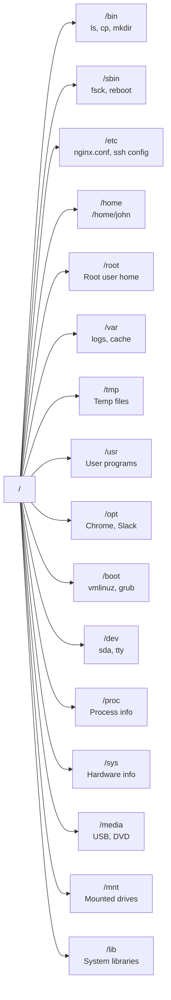

# Linux Operating System (OS)

- [Linux Operating System (OS)](#linux-operating-system-os)
  - [Linux Distributions (Distros) and Basics](#linux-distributions-distros-and-basics)
  - [Linux Basics and System Startup](#linux-basics-and-system-startup)
    - [Boot Process Overview](#boot-process-overview)
    - [Linux File Systems Basics](#linux-file-systems-basics)
      - [The Filesystem Hierarchy Standard (FHS)](#the-filesystem-hierarchy-standard-fhs)

> **What is Linux?**
>
> Linux is a free, open-source operating system used on:
>
> - Servers
> - Desktop computers
> - Embedded systems
>
> **Key Features:**
>
> - **Stable** - Runs reliably without crashes
> - **Secure** - Protected against viruses and malware
> - **Flexible** - Can be customized for different needs
>
> **Background:**
>
> - Based on Unix OS
> - Developed by a global community of developers

## Linux Distributions (Distros) and Basics

> **1. What are Linux Distributions?**
> Linux distributions are different versions of the Linux OS, each with its own features and user interfaces.
> Popular distributions include:
>
> - Ubuntu
> - Fedora
> - Debian
> - CentOS
> - Arch Linux
> - Red Hat Enterprise Linux (RHEL)
> - SUSE Linux Enterprise
> - Linux Mint
> - Manjaro
>
> **2. Choosing a Distribution:**
>
> - Consider your needs (e.g., user-friendliness, performance, support)
> - Try out different distros using live USBs or virtual machines
>
> **3. Basic Components of Linux:**
>
> - **Kernel** - Core of the OS that manages hardware and system resources
> - **Shell** - Command-line interface for interacting with the OS
> - **File System** - Organizes and stores files on the disk
> - **Processes** - Programs running on the system
> - **Users and Permissions** - Manage access to files and system resources
> - **Package Management** - Tools for installing and managing software
> - **Services and Daemons** - Background processes that provide functionality
> - **Networking** - Configuring and managing network connections
> - **System Logs** - Tracking system activity and errors
>
> **System Startup Process:**
>
> - **BIOS/UEFI** - Hardware initialization
> - **Boot Loader** - Loads the kernel (e.g., GRUB)
> - **Kernel Initialization** - Starts the core OS
> - **Init System** - Starts services (systemd, init, or upstart)
> - **Runlevels/Targets** - Defines system state and services to run

## Linux Basics and System Startup

### Boot Process Overview

> **Boot Process Steps:**
>
> **1. BIOS/UEFI Initialization**
>
> - Computer powers on
> - Performs hardware checks (POST - Power-On Self-Test)
> - Finds boot device (hard drive, SSD, or USB)
> - Loads boot loader
>
> **2. Boot Loader (GRUB)**
>
> - Shows menu to choose operating system
> - Loads Linux kernel into memory
> - Often stored in MBR or EFI partition
> - Can be customized for dual-boot setups
> - Hands control to kernel
>
> **3. Kernel Initialization**
>
> - Detects and initializes hardware
> - Mounts root filesystem (/)
> - Loads necessary drivers
> - Sets up memory and process management
> - Starts init system
>
> **4. Init System (systemd)**
>
> - Reads configuration files
> - Starts essential services:
>   - Networking
>   - Logging
>   - System daemons
> - Manages system state (targets/runlevels)
>
> **5. System Ready**
>
> - Starts remaining services based on target:
>   - **Multi-user target**: Command-line interface
>   - **Graphical target**: GUI desktop environment
> - Displays login prompt
> - System is ready for use
>
> **Shutdown Process:**
>
> - Stops all running services gracefully
> - Unmounts filesystems
> - Powers off hardware safely

### Linux File Systems Basics

> **Common File Systems:**
>
> - **ext4** - Default Linux filesystem; reliable for desktops/servers
> - **XFS** - High performance; used for large files and databases
> - **Btrfs** - Advanced features like snapshots; used in modern Linux systems
> - **FAT32** - Cross-platform compatibility; used for USB drives and shared storage
>
> **Flash Storage File Systems:**
>
> - **F2FS** - Optimized for SSDs and SD cards; used in Android devices
> - **JFFS2** - For embedded systems with NOR flash memory
> - **UBIFS** - For embedded Linux devices with NAND flash
>
> **Database File Systems:**
>
> - **Oracle ASM** - Manages storage for Oracle databases
> - **IBM GPFS** - High-performance shared storage for clusters
>
> **Special Purpose File Systems:**
>
> - **tmpfs** - RAM-based storage; fast temporary files (e.g., /tmp)
> - **procfs** - Virtual filesystem; system/process info (e.g., /proc)
> - **sysfs** - Virtual filesystem; hardware/driver info (e.g., /sys)
> - **devtmpfs** - Device files; hardware access (e.g., /dev)
>
> **Network File Systems:**
>
> - **NFS** - Share files across Linux/Unix networks
> - **CIFS/SMB** - Share files with Windows systems
> - **GlusterFS** - Distributed storage across multiple servers

#### The Filesystem Hierarchy Standard (FHS)

> The FHS defines the directory structure and directory contents in Linux systems.
>
> **Key Directories:**

> **Directory Usage Examples:**
>
> - **/bin** - Essential commands: `ls`, `cp`, `mkdir`
> - **/sbin** - System commands: `fsck`, `reboot`, `iptables`
> - **/etc** - Configuration: `nginx.conf`, `ssh/sshd_config`
> - **/home** - User directories: `/home/john/documents`
> - **/root** - Root user's home directory
> - **/var** - Variable data: `/var/log/syslog`, `/var/cache`
> - **/tmp** - Temporary files cleared on reboot
> - **/usr** - User programs: `/usr/bin/git`, `/usr/lib`
> - **/opt** - Optional software: Google Chrome, Slack
> - **/boot** - Boot files: `vmlinuz` (kernel), `grub/`
> - **/dev** - Device files: `sda` (disk), `tty` (terminal)
> - **/proc** - Process info: `/proc/cpuinfo`, `/proc/meminfo`
> - **/sys** - Hardware info: device drivers, kernel modules
> - **/media** - Removable media: USB drives, DVDs, CDs
> - **/mnt** - Temporary mount points for filesystems
> - **/lib** - Essential libraries for `/bin` and `/sbin`
>
> - **Notes:**
>   - File and directory names are case-sensitive
>     - `File.txt` and `file.txt` are different
>   - Use commands like `ls`, `cd`, `pwd`, `mkdir`, `rm` to navigate and manage files
