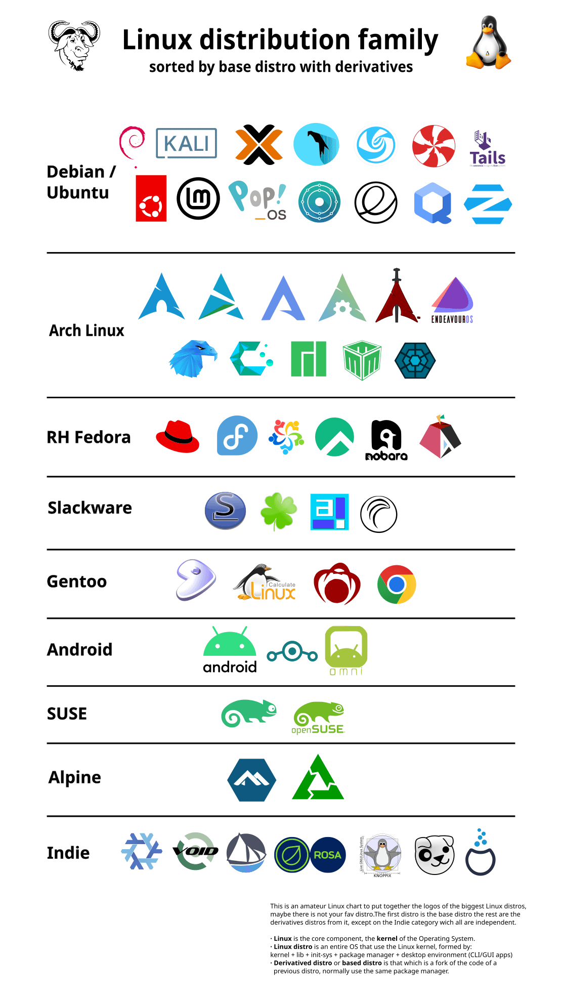
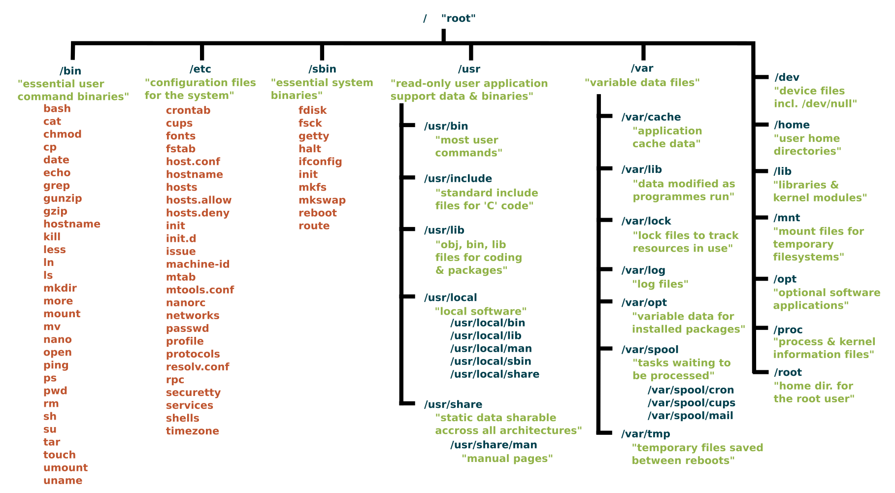

# Linux Operating System (OS)

- [Linux Operating System (OS)](#linux-operating-system-os)
  - [What is Linux?](#what-is-linux)
  - [Linux Distributions (Distros) and Basics](#linux-distributions-distros-and-basics)
  - [Linux Basics and System Startup](#linux-basics-and-system-startup)
    - [Boot Process Overview](#boot-process-overview)
    - [Linux File Systems Basics](#linux-file-systems-basics)
      - [The Filesystem Hierarchy Standard (FHS)](#the-filesystem-hierarchy-standard-fhs)
  - [Command Line Operations](#command-line-operations)
    - [The Command Line](#the-command-line)
    - [Basic Commands](#basic-commands)
      - [Turn on/off GUI](#turn-onoff-gui)
    - [Locating](#locating)
      - [Locating Programs](#locating-programs)
    - [Directory Navigation Commands](#directory-navigation-commands)
  - [Tips for Documentation](#tips-for-documentation)
    - [Using `man` Pages](#using-man-pages)
    - [`info` Pages](#info-pages)

## What is Linux?

Linux is a free, open-source operating system. You can find it running on:

- Servers
- Desktop computers
- Embedded systems

**Why use Linux?**

- **Stable** - Works reliably without crashing
- **Secure** - Better protection from viruses and malware
- **Flexible** - Easy to customize for your needs

**Quick History:** Linux is based on Unix and built by developers worldwide.

## Linux Distributions (Distros) and Basics

- **What are Linux Distributions?**

  > Think of distributions (distros) as different flavors of Linux. Each one looks and works a bit differently.

- **Popular choices:**

  - Ubuntu (beginner-friendly)
  - Fedora
  - Debian
  - CentOS
  - Arch Linux
  - Red Hat Enterprise Linux (RHEL)
  - SUSE Linux Enterprise
  - Linux Mint
  - Manjaro

  

- **How to pick one:**

  - Think about what you need (easy to use? fast performance? good support?)
  - Test a few using live USBs or virtual machines

- **What makes up Linux:**

  - **Kernel** - The brain that manages your hardware
  - **Shell** - Where you type commands
  - **File System** - How your files are organized
  - **Processes** - Programs currently running
  - **Users and Permissions** - Controls who can access what
  - **Package Management** - Tools to install software
  - **Services and Daemons** - Programs running in the background
  - **Networking** - How your computer connects to networks
  - **System Logs** - Records what happens on your system

- **How Linux starts up:**

  1. **BIOS/UEFI** - Checks your hardware
  2. **Boot Loader** - Loads Linux (uses GRUB)
  3. **Kernel** - Starts the core system
  4. **Init System** - Launches services (usually systemd)
  5. **Ready to use** - Shows login screen

## Linux Basics and System Startup

### Boot Process Overview

- **Step 1: BIOS/UEFI Initialization**

  - When you turn on your computer:

    - Hardware checks run automatically (POST test)
    - Finds where Linux is installed
    - Loads the boot loader

- **Step 2: Boot Loader (GRUB)**

  - Shows a menu to pick your operating system
  - Loads Linux into memory
  - Useful for computers with multiple OS installed

- **Step 3: Kernel Initialization**

  - The kernel takes over and:

    - Detects your hardware (keyboard, mouse, etc.)
    - Connects to your hard drive
    - Loads drivers
    - Sets up memory
    - Starts the init system

- **Step 4: Init System (systemd)**

  - Systemd starts important services:

    - Network connections
    - System logging
    - Background programs

- **Step 5: System Ready**

  - Linux finishes loading:

    - **Text mode**: Command-line interface
    - **Graphics mode**: Desktop environment
    - Shows login screen
    - You're ready to work!

- **When you shut down:**

  - Linux carefully:

    - Closes all programs
    - Saves your data
    - Disconnects from drives
    - Powers off safely

### Linux File Systems Basics

- **Common file systems explained:**

  - **For everyday use:**

    - **ext4** - Standard choice for Linux (reliable and tested)
    - **XFS** - Better for large files and databases
    - **Btrfs** - Modern option with backup features
    - **FAT32** - Works with Windows and Mac (good for USB drives)

- **For flash storage (SSDs and memory cards):**

  - **F2FS** - Best for SSDs and SD cards (used in Android)
  - **JFFS2** - For small embedded devices
  - **UBIFS** - For industrial Linux devices

- **For databases:**

  - **Oracle ASM** - Manages Oracle database storage
  - **IBM GPFS** - For large computer clusters

- **Special types:**

  - **tmpfs** - Uses RAM (very fast, but temporary)
  - **procfs** - Shows system information in /proc
  - **sysfs** - Shows hardware information in /sys
  - **devtmpfs** - Represents hardware devices in /dev

- **For sharing files over networks:**

  - **NFS** - Share between Linux computers
  - **CIFS/SMB** - Share with Windows computers
  - **GlusterFS** - Spread storage across multiple servers

#### The [Filesystem](./topics/06_file-system/file-system.md) Hierarchy Standard (FHS)

- The FHS defines the directory structure and directory contents in Linux systems.

- **Key Directories:**

  

  > **Directory Usage Examples:**
  >
  > - **/bin** - Essential commands: `ls`, `cp`, `mkdir`
  > - **/sbin** - System commands: `fsck`, `reboot`, `iptables`
  > - **/etc** - Configuration: `nginx.conf`, `ssh/sshd_config`
  > - **/home** - User directories: `/home/john/documents`
  > - **/root** - Root user's home directory
  > - **/var** - Variable data: `/var/log/syslog`, `/var/cache`
  > - **/tmp** - Temporary files cleared on reboot
  > - **/usr** - User programs: `/usr/bin/git`, `/usr/lib`
  > - **/opt** - Optional software: Google Chrome, Slack
  > - **/boot** - Boot files: `vmlinuz` (kernel), `grub/`
  > - **/dev** - Device files: `sda` (disk), `tty` (terminal)
  > - **/proc** - Process info: `/proc/cpuinfo`, `/proc/meminfo`
  > - **/sys** - Hardware info: device drivers, kernel modules
  > - **/media** - Removable media: USB drives, DVDs, CDs
  > - **/mnt** - Temporary mount points for filesystems
  > - **/lib** - Essential libraries for `/bin` and `/sbin`
  >
  > - **Notes:**
  >   - File and directory names are case-sensitive
  >     - `File.txt` and `file.txt` are different
  >   - Use commands like `ls`, `cd`, `pwd`, `mkdir`, `rm` to navigate and manage files

## Command Line Operations

The command line lets you control Linux by typing text commands. It’s powerful and fast once you get used to it.

### The Command Line

Commands usually look like this:

```shell
command [options] [arguments]

# Example:
ls -l /home/user
```

- `command` is what you want to do (like `ls` to list files)
- `[options]` change how the command works (like `-l` for more details)
- `[arguments]` are extra info (like a folder name)

### Basic Commands

#### Turn on/off GUI

- To switch to text mode (no GUI):

  ```shell
  sudo systemctl stop gdm

  # or

  sudo telinit 3
  ```

- To switch back to GUI mode:

  ```shell
  sudo systemctl start gdm

  # or

  sudo telinit 5
  ```

### Locating

- Softwares programs and packages usually there in a particular location depending on their type and purpose. Here are some common locations:

  - **/bin** - Essential command binaries (programs)
  - **/sbin** - System binaries (programs for system admin)
  - **/usr/bin** - Non-essential user command binaries
  - **/usr/sbin** - Non-essential system binaries
  - **/usr/local/bin** - Locally compiled user binaries
  - **/usr/local/sbin** - Locally compiled system binaries
  - **/lib** - Essential shared libraries
  - **/usr/lib** - Non-essential shared libraries
  - **/usr/local/lib** - Locally compiled shared libraries
  - **/opt** - Optional software packages
  - **/etc** - Configuration files
  - **/var/log** - Log files

#### Locating Programs

- To find where a program is located, you can use the `which` or `whereis` commands.

  - Example using `which`:

    ```shell
    which python3
    ```

    This will return the path to the `python3` executable, e.g., `/usr/bin/python3`.

  - Example using `whereis`:

    ```shell
    whereis python3
    ```

    This will return multiple locations related to `python3`, including binaries, source files

### Directory Navigation Commands

- **Change Directory (`cd`)**: Move between directories.

  ```shell
  cd /path/to/directory  # Go to specified directory
  cd ..                  # Go up one level
  cd ~                   # Go to home directory
  cd $HOME              # Go to home directory
  cd -                   # Go to previous directory
  ```

## Tips for Documentation

### Using `man` Pages

- The `man` command shows the manual for other commands.

  ```shell
  man command
  ```

  - Example:

    ```shell
    man ls
    ```

    This shows the manual for the `ls` command, explaining its options and usage.

- To exit the `man` page, press `q`.

### `info` Pages

- The `info` command provides more detailed documentation than `man`.

  ```shell
  info command
  ```

  - Example:

    ```shell
    info ls
    ```

    This shows the info page for the `ls` command, which may include additional details and examples.

- To navigate `info` pages:
  - Use the arrow keys to move up and down.
  - Press `q` to quit the info page.
